# Web Scraping with Splinter and Beautiful Soup

## Mission to Mars
In this module, Robin works as a data analyst for a company called SpaceForward, and she has been tasked with gathering information about the climate of Mars, as well as news items about Mars missions. She knows a couple websites where this information is located and will use web scraping tools such as Splinter and Beautiful Soup to extract the information she needs.

After some practice with web scraping earlier in the module, we are going to help her with her final deliverables shown below (from the Module Challenge webpage), which have been divided into subtasks further down. The text for each deliverable is taken from the starter files. Below each subtask is an image of the Python script necessary to complete it. All Python script used in this Challenge can be found in [part_1_mars_news.ipynb](part_1_mars_news.ipynb) and [part_2_mars_weather.ipynb](part_2_mars_weather.ipynb).

- **Deliverable 1: Scrape Titles and Preview Text from Mars News**.
- **Deliverable 2: Scrape and Analyze Mars Weather Data**.

## Resources
- Software: Python 3.7.7, Conda 22.11.0, Jupyter Notebook 5.7.10

## Deliverable 1: Scrape Titles and Preview Text from Mars News

1. Visit the website. 

    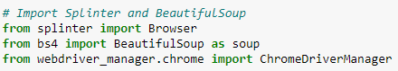

    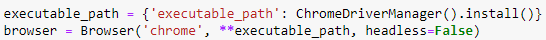

    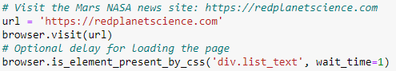

2. Scrape the website.

    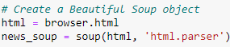

    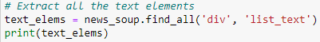

3. Store the results. 

    

    

    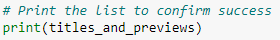

    

4. Export the data. Data in .json format can be found here: [titles_and_previews.json](resources/titles_and_previews.json)

    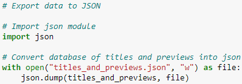

    

## Deliverable 2: Scrape and Analyze Mars Weather Data

1. Visit the website. 

    

    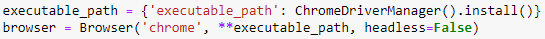

    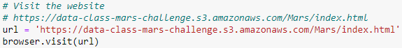

2. Scrape the website.

    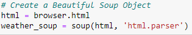

    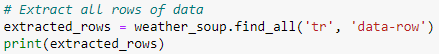

3. Store the data.

    

    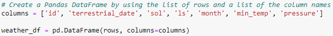

    

4. Prepare data for analysis.

    

    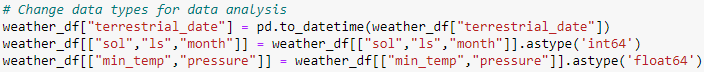

    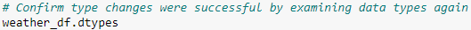

5. Analyze the data.

    5.1: How many months are there on Mars?

    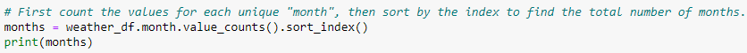

    5.2: How many Martian days' worth of data are there?

    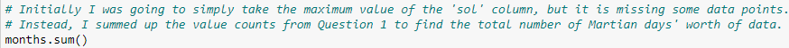

    5.3: What is the average low temperature by month?

    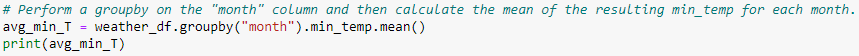

    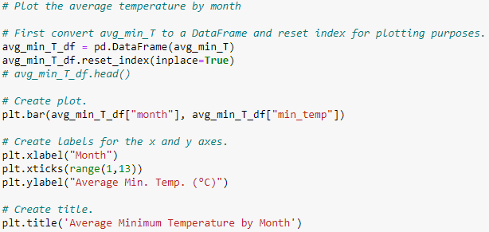

    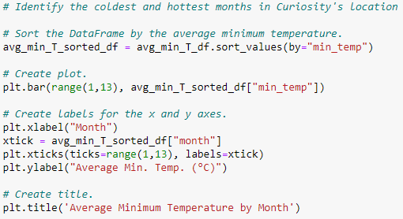

    5.4: What is the average pressure by Martian month?

    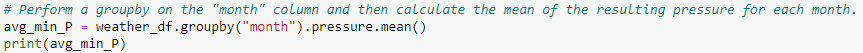

    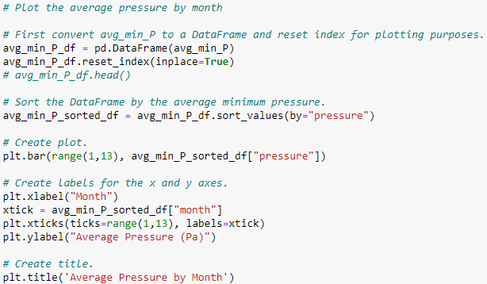

    5.5: How many terrestrial (earth) days are there in a Martian year?

    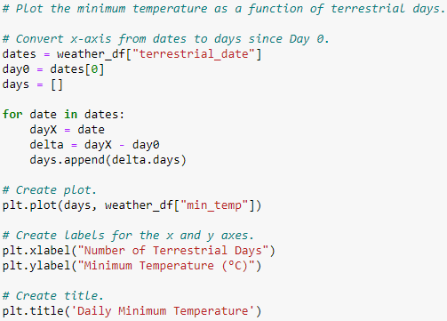

6. Save the data. The exported .csv file containing the Martian Weather Data can be found here: [martian_weather_data.csv](resources/martian_weather_data.csv).

    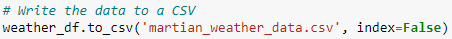

    

## Results & Analysis

1. How many months are there on Mars?

    The resulting table shows that there are 12 unique Martian months.

    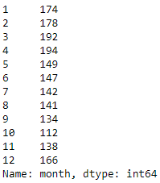

2. How many Martian days' worth of data are there?

    There are 1,867 Martian days' worth of data.

3. What is the average low temperature by month?

    The resulting table is shown below, along with two plots. The first shows the average minimum temperature as a function of sequential months. The second shows the average minimum temperature by month sorted from lowest to highest temperature.

    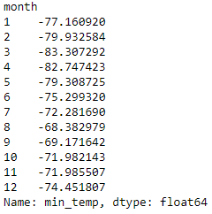

    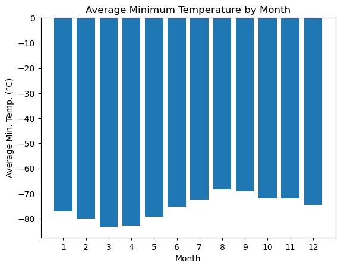

    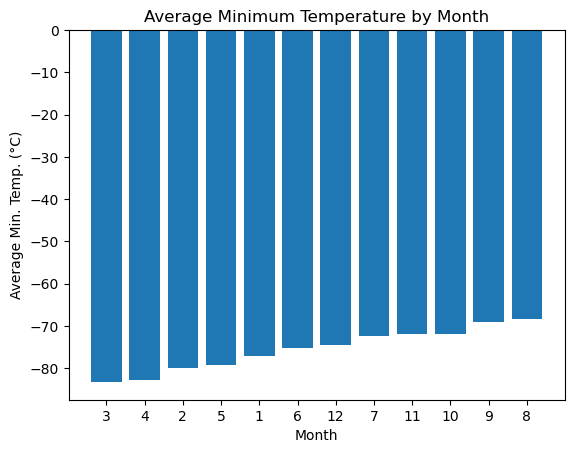

    The coldest month is Month 3 (-83.3°C).

    The hottest month is Month 8 (-68.4°C).

4. What is the average pressure by Martian month?

    The resulting table is shown below, along with a plot showing the average pressure by month sorted from lowest to highest pressure.

    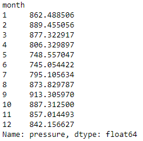

    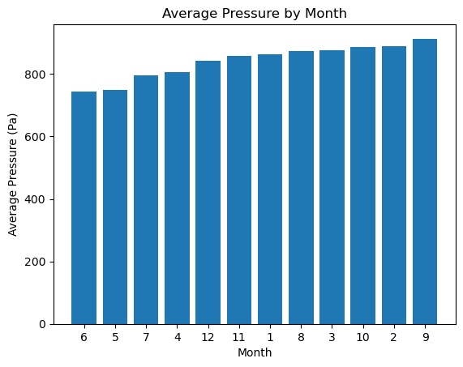

    Month 6 has the lowest average atmospheric pressure (745 Pa).

    Month 9 has the highest average atmospheric pressure (913 Pa).

5. How many terrestrial (earth) days are there in a Martian year?

    The plot of daily minimum temperature vs. the number of the terrestrial day on which the measurement was taken is shown below.

    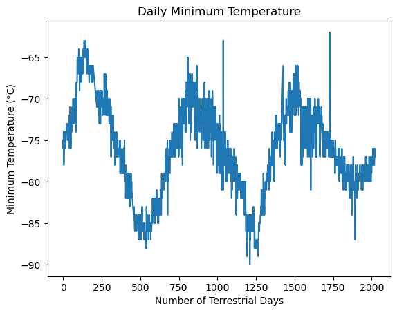

    To calculate the length of a Martian year from this data, we can examine the length of time between peaks. There are 3 maxima and 3 minima. First find the terrestrial day for each peak.

    - Max. Peak #1: Days 137 and 146 at -63°C. Split the difference... Day: 141.5
    - Max. Peak #2: Days 807 and 809 at -65°C. Split the difference... Day: 808
    - Max. Peak #3: Days 1509 and 1521 at -66°C. Split the difference... Day: 1515
    - Min. Peak #1: Days 536 and 539 at -88°C. Split the difference... Day: 537.5
    - Min. Peak #2: Day 1263 at -89°C
    - Min. Peak #3: Day 1891 at -89°C

    Then, calculate the difference in days between the maxima and minima.

    - Max2 - Max1 = 808 - 141.5 = 666.5 days
    - Max3 - Max2 = 1515 - 808 = 707 days
    - Min2 - Min1 = 1263 - 537.5 = 725.5 days
    - Min3 - Min2 = 1891 - 1263 = 628 days

    Finally, take the average of those 4 results to calculate the length of a Martian year. My result was 682 days, which comes within 0.7% of the actual length of a Martian year (687 days).